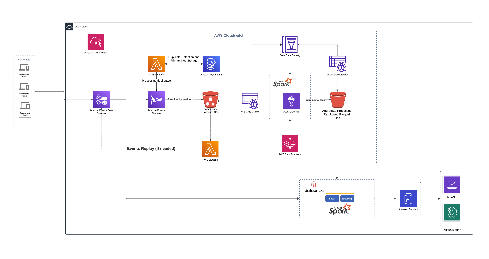

# AWS Event-Driven Data Lake

## Overview
This repository contains the code and infrastructure to create a robust, scalable data lake using AWS services. The system is designed to ingest, process, and store events coming from an Amazon Kinesis Data Stream. The architecture ensures high performance, scalability, and efficient querying capabilities, making it ideal for processing up to 1 million events per hour.

### Features
- Scalable Event Ingestion: Utilize Amazon Kinesis Data Streams to handle large volumes of incoming events.
- Real-time Processing: AWS Lambda functions for real-time deduplication and data transformation.
- Efficient Storage: Store transformed data in Amazon S3 using efficient columnar formats like Apache Parquet.
- Partitioned Data: Organize data in S3 partitions for optimized querying and scalability.
- Data Lake: Use Databricks for advanced analytics and Business Intelligence (BI) reporting.
- Infrastructure as Code: Deploy infrastructure using AWS CloudFormation or Terraform for consistent and repeatable environments.

## Architecture

<p align="center">


</p>


## Architecture Flow

1. **Customers (Desktop and Mobile)**: Users generate events via desktop and mobile devices.
2. **Amazon Kinesis Data Streams**: Captures and streams real-time data from multiple customer events.
3. **Amazon CloudWatch**: Monitors the performance and health of the streaming data pipelines.
4. **AWS Lambda**: Processes incoming data, detects duplicates, and handles data transformation.
5. **Amazon DynamoDB**: Stores unique identifiers for duplicate detection and primary key management.
6. **Amazon Kinesis Firehose**: Delivers processed and transformed data to Amazon S3 in raw JSON format, partitioned by event type.
7. **Amazon S3 (Raw JSON Files)**: Serves as the data lake storage, storing raw JSON files as partitioned by event type.
8. **AWS Glue Crawler**: Scans the raw JSON files in S3 and updates the Glue Data Catalog with table definitions.
9. **AWS Glue Data Catalog**: Central metadata repository for data discovery and search.
10. **AWS Glue Job (Apache Spark)**: Transforms raw JSON data into aggregated, partitioned Parquet files, managing incremental loads.
11. **Amazon S3 (Processed Data Storage)**: Stores the transformed and aggregated Parquet files.
12. **Databricks with Apache Spark**: Processes both batch and streaming data from Amazon S3 for advanced analytics.
13. **Visualization and ML/AI**: Utilizes the processed data for generating insights through visualization tools and machine learning models.
14. **Events Replay (AWS Lambda)**: Replays events from raw JSON files if needed for data recovery or reprocessing.

### Detailed Explanation of Each Component

### Amazon Kinesis Data Streams

#### Functionality
- **Real-time Data Streaming**: Handles massive streams of data in real-time, ensuring that incoming events are immediately available for processing.
- **Multiple Consumers**: Allows multiple applications to process or analyze the stream data concurrently, facilitating a variety of use cases from real-time analytics to alerting systems.
- **Sharding**: Supports sharding to scale horizontally, distributing incoming data across multiple shards to accommodate increasing data throughput.
- **Data Retention**: Provides a retention period for data, allowing applications to reprocess or replay the stream for a defined period, ensuring data availability for troubleshooting and reanalysis.

#### Key Advantages
- Easily scales to handle large volumes of data.
- Data is replicated across multiple availability zones for durability and availability.
- Enables real-time analytics and processing of streaming data.
- **Scalability**: Easily scales to handle large volumes of data.
- **Durability and Availability**: Data is replicated across multiple availability zones.
- **Real-time Processing**: Enables real-time analytics and processing of streaming data.
- **Flexibility**: Allows multiple consumers to process the same stream data concurrently.

### AWS Lambda

#### Functionality
- **Serverless Compute**: Runs code in response to events, automatically managing the underlying compute resources, eliminating the need for server management.
- **Supports Multiple Languages**: Supports various programming languages including Python, Node.js, Java, and more, providing flexibility in development.
- **Seamless Integration**: Integrates with a wide range of AWS services such as S3, DynamoDB, Kinesis, and more, enabling complex event-driven architectures.
- **Automatic Scaling**: Automatically scales based on the number of incoming events and execution demand, ensuring performance under varying loads.

#### Key Advantages
- Automatically handles the infrastructure, eliminating server management.
- Scales automatically with the volume of incoming requests.
- Cost-efficient as you pay only for the compute time you use.
- **No Server Management**: Automatically handles the infrastructure.
- **Scalability**: Automatically scales with the volume of incoming requests.
- **Cost-efficient**: Pay only for the compute time you use.
- **Wide Integration**: Seamlessly integrates with various AWS services for event-driven architecture.

### Amazon DynamoDB

#### Functionality
- **Managed NoSQL Database**: Provides fast and predictable performance with seamless scalability, handling key-value and document data models.
- **DynamoDB Streams**: Captures item-level changes and enables real-time data processing, facilitating downstream processing and analytics.
- **Global Tables**: Supports multi-region replication, ensuring high availability and disaster recovery capabilities.
- **On-Demand and Provisioned Modes**: Offers flexible pricing models to optimize cost and performance based on workload requirements.

#### Key Advantages
- Provides consistent, low-latency performance.
- Automatically scales to handle large volumes of data and high request rates.
- Fully managed, handling provisioning, patching, and scaling of the database.
- **Performance**: Provides consistent, low-latency performance.
- **Scalability**: Automatically scales to handle large volumes of data and high request rates.
- **Fully Managed**: Handles provisioning, patching, and scaling of the database.
- **Global Availability**: Supports multi-region replication with Global Tables for high availability.

### Amazon Kinesis Firehose

#### Functionality
- **Managed Delivery Service**: Delivers real-time streaming data to destinations such as S3, Redshift, Elasticsearch, and Splunk.
- **Data Transformation**: Supports transformation, compression, and encryption of data before delivery, enhancing data usability and security.
- **Automatic Scaling**: Automatically scales to match the throughput of your data streams, ensuring consistent performance.
- **Buffering Hints**: Allows configuration of buffering hints to control the size and interval for data delivery, optimizing performance and cost.

#### Key Advantages
- Simplifies the process of capturing and storing streaming data.
- Built-in support for transforming data before delivery.
- Seamlessly integrates with various AWS services.
- **Ease of Use**: Simplifies the process of capturing and storing streaming data.
- **Transformation**: Built-in support for transforming data before delivery.
- **Integration**: Integrates seamlessly with various AWS services.
- **Automatic Scaling**: Automatically adjusts to match data throughput.

### Amazon S3

#### Functionality
- **Scalable Object Storage**: Provides scalable object storage with high availability and durability, supporting a wide range of storage classes.
- **Data Management Features**: Offers features like versioning, lifecycle policies, and cross-region replication, facilitating data management and protection.
- **Integration with AWS Services**: Integrates with other AWS services for data processing, analytics, and machine learning, enabling comprehensive data workflows.
- **Security Features**: Provides robust security features including encryption, access controls, and compliance certifications.


- Virtually unlimited storage capacity.
- Designed for 99.99% durability and 99.99% availability.
- Various storage classes to optimize costs based on access patterns.
- **Scalability**: Virtually unlimited storage capacity.
- **Durability and Availability**: Designed for 99.99% durability and 99.99% availability.
- **Cost-Effective**: Various storage classes to optimize costs based on access patterns.
- **Versatility**: Supports a wide range of use cases from backups to big data analytics.

### AWS Glue Crawler and Data Catalog

#### Functionality
- **Metadata Discovery**: Automatically discovers data and registers metadata in the Glue Data Catalog, simplifying data management.
- **Centralized Metadata Repository**: Glue Data Catalog serves as a central repository for metadata, making data easily discoverable and searchable.
- **Schema Management**: Manages schema evolution and data versioning, ensuring data consistency and integrity.

#### Key Advantages
- **Automation**: Automates the process of metadata discovery and registration, reducing manual effort and errors.
- **Centralized Management**: Centralizes metadata management, facilitating data discovery, governance, and compliance.
- **Integration**: Seamlessly integrates with other AWS data services for efficient data processing and analytics.

### AWS Glue Job (Apache Spark)

#### Functionality
- **ETL Processing**: Executes ETL (Extract, Transform, Load) jobs using Apache Spark, processing raw data into refined formats.
- **Distributed Computing**: Leverages Spark’s distributed computing capabilities for scalable data processing.
- **Incremental Loads**: Handles incremental data loads and schema evolution, ensuring up-to-date data.
- **Data Quality Enforcement**: Incorporates data quality checks and validation to ensure data integrity.

#### Key Advantages
- **Scalable Processing**: Supports large-scale data processing with Spark’s distributed computing, accommodating growing data volumes.
- **Performance**: Optimized for high performance, enabling fast and efficient data transformations.
- **Flexibility**: Supports complex ETL workflows and various data formats, enhancing flexibility and usability.
- **Data Quality**: Ensures high data quality with built-in validation and schema enforcement.

### Databricks with Apache Spark

#### Functionality
- **Unified Analytics Platform**: Built on Apache Spark, supports large-scale data processing and analytics.
- **Interactive Workspace**: Provides an interactive workspace for collaboration among data scientists, engineers, and analysts.
- **Batch and Streaming Processing**: Supports both batch and streaming data processing, enabling real-time and historical analysis.
- **Advanced Analytics and ML**: Integrates with machine learning libraries and tools for advanced analytics and model training.

#### Key Advantages
- Efficiently handles big data processing and analytics.
- Provides high-level APIs in Java, Scala, Python, and R.
- Optimized for performance with in-memory computing.
- **Scalability**: Processes large datasets efficiently using distributed computing.
- **Flexibility**: Supports various data processing and analytics workloads.
- **Integration**: Seamlessly integrates with numerous data sources and downstream tools.
- **Collaboration**: Interactive workspace enhances collaboration among team members.
- **Performance**: Optimized for fast data processing with in-memory computing capabilities.

### Events Replay (AWS Lambda)

#### Functionality
- **Event Replay**: Allows replaying events from raw JSON files stored in S3, facilitating data recovery and reprocessing.
- **Automated Recovery**: Automates the process of replaying events, ensuring minimal downtime and data loss.

#### Key Advantages
- **Data Integrity**: Ensures data integrity and availability for reprocessing, maintaining data quality.
- **Automation**: Automates the replay process, reducing manual intervention and errors.
- **Resilience**: Enhances system resilience by enabling data recovery and reprocessing in case of failures or errors.

---


## Design Questions

**1. How would you handle duplicate events?**

- To manage duplicates efficiently and process streaming data in real-time, we use AWS Kinesis Data Stream, AWS Lambda, and DynamoDB. 
- The Kinesis stream captures incoming data, and the Lambda function processes each record, checking for duplicates using DynamoDB.
- This approach ensures only unique data is stored in S3, with DynamoDB acting as a cache to filter duplicates.

**For detailed code logic, refer to the [Detailed Implementation README.md](./scripts/README.md)**

---

**2. How would you partition the data to ensure good querying performance and scalability?**

### Detailed Partitioning Strategy

#### Amazon S3 Partitioning
Amazon S3 serves as the primary storage layer in your data lake. Proper partitioning of data stored in S3 can significantly enhance query performance and scalability.

##### Partitioning Structure
- **Event Type:** Top-level directory that segregates data based on the type of event. This is useful for quickly narrowing down searches to specific event categories.
- **Event Subtype:** Sub-directory within each event type that further categorizes events. This adds an additional layer of granularity, making it easier to query specific subsets of event types.
- **Year/Month/Day:** Temporal partitioning based on the date the event occurred. This structure supports efficient time-based queries and ensures that data can be easily managed and archived.

##### Example Directory Structure
```
s3://your-bucket-name/event_type/event_subtype/year/month/day/
```

#### Example Breakdown
- **event_type:** Type of the event (e.g., "account", "lesson", "payment").
- **event_subtype:** Further categorization within each event type (e.g., "created", "started", "order").
- **year/month/day:** Temporal partitions to organize data chronologically.

#### Benefits of This Partitioning Strategy
1. **Improved Query Performance:**
   - By organizing data into partitions, queries can be directed to specific directories, reducing the amount of data scanned.
   - Temporal partitioning allows efficient time-range queries, which are common in analytical workloads.

2. **Scalability:**
   - This hierarchical partitioning scheme allows the data lake to grow efficiently without compromising performance.
   - New partitions can be added dynamically as new event types or dates are encountered, supporting continuous data ingestion.

3. **Data Management:**
   - Facilitates easier data management tasks such as data lifecycle policies, backups, and archival.
   - Data can be easily purged or archived based on time-based partitions.

### Glue Data Catalog Partitioning
AWS Glue Crawler will automatically recognize these partitions and add them to the Glue Data Catalog. This metadata catalog will be used to optimize query performance further.

#### Glue Crawler Configuration
- **Schedule:** Set the Glue Crawler to run periodically (e.g., hourly, daily) to keep the metadata up to date with the latest partitions.
- **Classifier:** Use classifiers to correctly interpret the schema of your partitioned data.

### Key Points for Partitioning Strategy
1. **Event Type and Subtype Partitioning:**
   - Allows quick filtering of relevant events.
   - Enhances query performance by reducing the amount of data scanned.

2. **Temporal Partitioning:**
   - Supports efficient time-based queries and data management.
   - Facilitates easier data archiving and lifecycle management.

3. **Glue and Databricks Integration:**
   - Glue Crawler and Catalog ensure that partitions are recognized and optimized for query performance.
   - Databricks utilizes these partitions for advanced analytics, ensuring efficient data processing.

By implementing this detailed partitioning strategy, you ensure that your data lake is well-organized, scalable, and optimized for high-performance querying.

**For detailed code logic, refer to the [Detailed Implementation README.md](./scripts/README.md)**

---

**3. What format would you use to store the data?**

---

**4. How would you test the different components of your proposed architecture?**

---

**5. How would you ensure the architecture deployed can be replicable across environments?**

---

**6. Would your proposed solution still be the same if the amount of events is 1000 times smaller or bigger?**

---

**7. Would your proposed solution still be the same if adding fields / transforming the data is no longer
needed?**

---